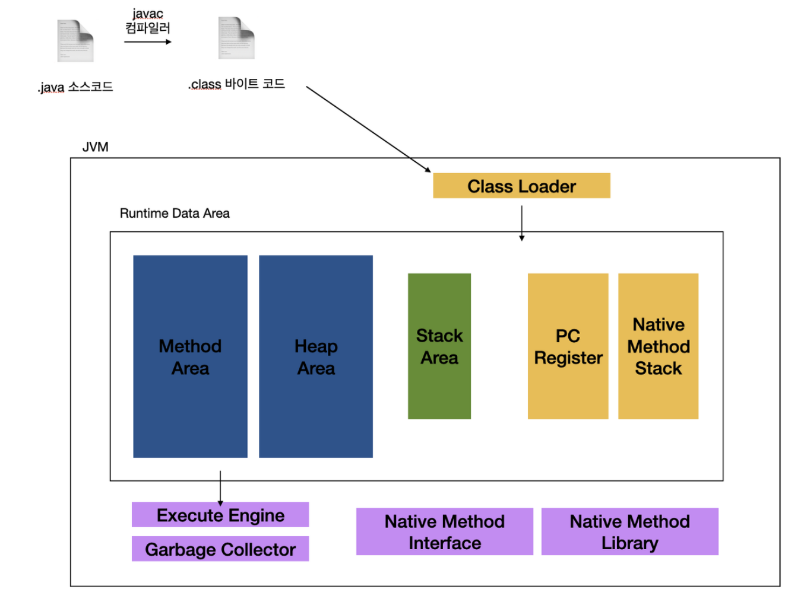
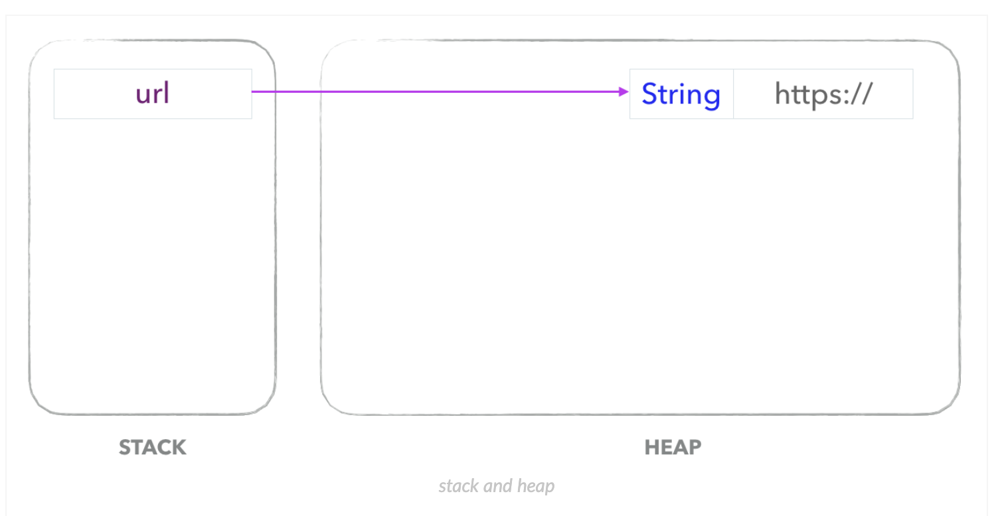

# JVM

## JVM 동작 과정

1. .java 파일을 컴파일러가 자바 바이트 코드인 .class로 변환
2. .class 코드를 JVM 클래스 로더에게 보냄
3. 클래스 로더를 통해 JVM Runtime Data Area로 로딩
4. Execution Engine 을 통해 해석
5. 해석된 바이트 코드는 Runtime Data Area의 각 영역에 배치.

JVM은 OS로부터 프로그램을 수행하는 데에 필요한 메모리를 할당 받는다.

## Runtime Data Area
- 모든 쓰레드가 공유해서 사용
    - method(static) 영역
        클래스 멤버 변수의 이름, 데이터 타입, 접근 제어자 정보와 같은 각종 필드 정보들과 메서드 정보, 데이터 Type 정보, Constant Pool, static변수, final class 등이 생성되는 영역
        JVM이 동작해서 클래스가 로딩될 때 생성되고, JVM이 종료될 때까지 유지된다.

    - heap 영역
        new 키워드로 생성된 객체와 배열이 생성되는 영역
        주기적으로 GC가 제거하는 영역이다.

- 쓰레드 마다 별도 생성
    - stack 영역
        메소드 내에서 정의하는 primitive type에 해당되는 지역변수의 데이터의 값이 저장되는 공간
        메소드가 호출될 때 메모리에 할당되고 종료되면 해제

### 메소드 내에서 할당되는 객체는 어디에 할당될까?

stack 영역에는 참조 변수(위 예제에서 `url`)만 올라가고, 실제 객체는 heap 에 올라가게 된다.

메소드가 종료되면 stack영역에 있는 url이 해제되면서 둘 사이의 링크가 끊기고, GC가 돌 때 참조가 되지 않는 String 객체를 해제하게 된다.

## PC(Program Counter) register
- 현재 JVM이 실행 중인 명령의 주소를 저장
- 스레드 마다 별도 컨텍스트를 가질 수 있도록 개별 PC register를 가짐

## Native Method Stack
- 자바 바이트 코드가 아닌 실제로 수행될 수 있는 기계어로 작성된 프로그램의 호출을 저장
- 스레드 마다 개별적으로 가짐
- JVM은 JNI(Java Native Interface)를 제공하는데, JVM이 번역한 자바 바이트 코드가 실제로 CPU에서 실행될 때 필요한 기계어 등을 저장해 놓음

## Compile? Interpreter?
Java는 컴파일 언어이기도 하고, 인터프리터 언어이기도 하다.
Java 컴파일러가 .java 파일을 **자바 바이트 코드**로 변환한 이후, JVM의 자바 인터프리터가 자바 바이트 코드를 한 줄씩 읽으면서 컴퓨터가 이해할 수 있는 2진수로 번역하여 실행한다.
### 그러면 Java도 느린가?
인터프리터 언어의 성격을 가지고 있기 때문에 Java 역시도 성능 이슈가 존재했다.
그래서 도입된 것이 JIT(Just In Time)컴파일러인데, 이 녀석은 바이트 코드를 해석한 이후 캐싱을 해둔다. 따라서 반복되는 코드나 함수를 여러번 해석하지 않기 때문에 성능이 향상된다.