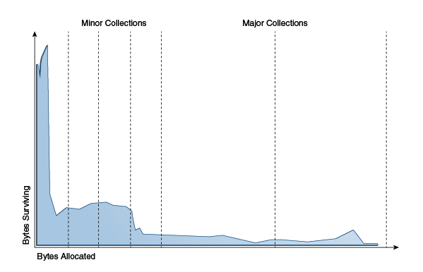

# java의 Garbage Collection

GC 는 Heap 메모리 영역에서 더 이상 필요하지 않은 객체를 찾아 지우는 작업을 하는데, java의 gc는 'Weak generation hypothesis' 라는 가설 하에 만들어졌다.

[**Weak generation hypothesis**]

대부분의 응용 프로그램들의 object 들은 생성되지 얼마 가지 않아 소멸된다는 가설

이러한 가설이 바탕이 되어 jvm에서는 Heap을 Young 과 Old 라는 영역을 논리적으로 분리해 놓는다.

- Young 영역 (Young generation)
    - 객체가 생성되면, Young 영역에 할당된다. 
    - Old 영역과 비교하여 GC가 더 빈번하게 발생한다. 이를 Minor GC라고 부른다.

- Old 영역 (Old generation)
    - Young 영역에서 GC가 발생하고 살아남은 객체들은 Old 영역으로 이동한다.
    - Young 영역보다 크게 할당된다.
    - Young 영역보다 GC가 적게 발생하며, 이를 Major GC라고 부른다.
## GC 동작 방식

- Stop The World

    GC를 실행하기 위해 JVM이 애플리케이션의 실행을 멈춘다. GC가 실행될 때는 **GC를 실행하는 쓰레드를 제외한 모든 쓰레드들의 작업이 중단**되고, GC가 완료되면 작업이 재개된다.
    Garbage Collection는 Garbage Collector가 Heap 영역의 메모리를 JVM이 판단해 더이상 사용되지 않는 인스턴스는 자동으로 할당 된 메모리를 삭제하는 역할을 하는 행위이다.

- Mark and Sweep

    GC root 에서 시작해 root 가 참조하는 모든 오브젝트를 탐색해 내려가며 Mark 한다. GC root는  힙 외부에서 접근할 수 있는 변수나 오브젝트를 뜻한다. (실행중인 쓰레드, 정적 변수, 로컬 변수 등)

    Mark가 끝나면 GC는 Heap 내부를 돌면서 Mark되지 않은 메모리들을 해제한다. 이 과정을 Sweep이라고 부른다.

- Minor GC

    Young 영역은 1개의 Eden 영역과 2개의 Survivor 영역, 총 3가지로 나눠진다.

    객체가 새로 생성되면 Eden 영역에 할당되고, **Eden 영역이 꽉 차면 Minor GC가 발생하게 된다. 이 때 사용되지 않는 메모리는 해제되고, 사용중인 객체는 Survivor 영역으로 옮겨진다. 이 과정이 반복되어 살아남은 객체는 Old 영역으로 이동된다.

- Major GC

    Old 영역의 메모리가 부족해지면 발생한다. Young 영역의 GC는, 비교적 메모리 크기가 작기 때문에 보통 0.5초에서 1초 사이에 끝나지만, Old 영역은 메모리가 크기 때문에 10배 이상의 시간이 사용된다.

GC 튜닝이라고 하면 이와 같이, Stop the World로 인해 Thread의 작업이 멈추는 시간을 최소한으로 줄이는 행위라고 보면 된다.

각 서비스의 WAS에서 생성하는 객체의 크기와 생존 주기가 모두 다르고, 장비의 종류도 다양하다. WAS의 스레드 개수와 장비당 WAS 인스턴스 개수, GC 옵션 등은 지속적인 튜닝과 모니터링을 통해서 해당 서비스에 가장 적합한 값을 찾아야 한다.